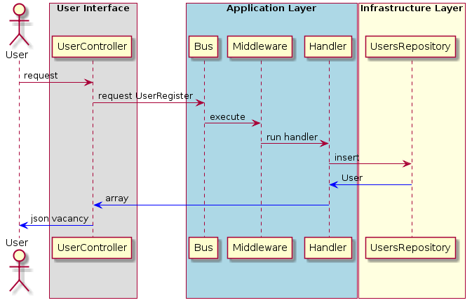

# CarPar for Cloud8020

### Стэк:
- php 7.2
- MySql 5.6
- Laravel
- Vue.js
- Vuex
- Vue-router
- Eloquent ORM

### Дополнительные библиотеки:
 - firebase/php-jwt (для работы с JWT);
 - joselfonseca/laravel-tactician (библиотека CommandBus);

Проект тестового задания (прототип). Репозитории в даном случаи выступаю
как абстакный уровень работы с базой данных (в моем случаи завязанны на
Eloquent ORM).Сам проект находиться в папке CarPark.
Проект выполнялся под Open Server в дальнейшем планируется перенос на Docker.

### Структура папки CarPark:

- CommonModule: хранятся классы для мнгогократного использования;
- UserModule: Модуль по работе с пользователем;

### Структура UserModule модуля:
- UI: уровень представления. Хранятся роуты, контроллеры и консольные команды;
- Application: уровень приложения. Расположенны комманды, запросы, DTO, сервисы, 
 (в них разположены обработчики команд), middleware, исключения.
- Infrastructure: уровень инфраструктуры. Хранятся репозитории, интерфейсы,
  папка Laravel (модели Eloquent ORM миграции, seeder, providers);

### Пример работы UserModule модуля:

### Перед стартом приложения добавить .env файл (изменить настройки базы данных под MySql)

### Команда для выполнения миграций для модуля UserModule:
- php artisan migrate --path=MyProject/UserModule/Infrastructure/Migrations/

### Команда для выполнения seeder:
- php artisan db:seed --class=CarPark\UserModule\Infrastructure\Laravel\Database\Seeders\User

 ### Команда для выполнения тестов:
- vendor\bin\phpunit tests\

